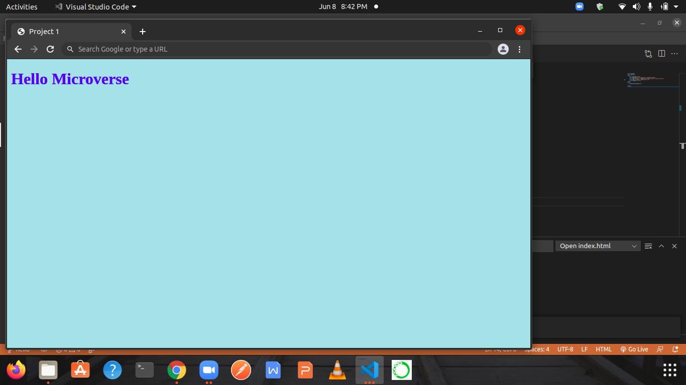

# Hello Microverse

> In this project, I will set up a "first project" repository.The goal here is to master all of the tools and best practices I learned about in previous steps. I will be using them in all Microverse projects and most likely in my future job as well, so it is important to know them!

Additional description about the project and its features.

## Built With

- Major languages
HTML and CSS

## Live Demo

[Live Demo Link](https://kaneez98fatima.github.io/first_project/)

## Getting Started

**Create branches with different base branches Understand the concept of version control**
>Follow Gitflow

>Open pull requests in GitHub.

>Write descriptive, easy to understand commit messages.

>Write short, detailed, easy to understand descriptions of pull requests.

>Write a descriptive and easy to understand README in business English for every project submitted.

> Demonstrate an ability to submit a project for code review**

To get a local copy up and running follow these simple example steps.

### Setup
> Linter Set Up required
### Install
>VS code
### Usage
> For learning purpose

## Authors

👤 **Kaneez Fatima**

- GitHub: [@githubhandle](https://github.com/githubhandle)
- Twitter: [@twitterhandle](https://twitter.com/twitterhandle)
- LinkedIn: [LinkedIn](https://linkedin.com/in/linkedinhandle)

👤 **Author2**

- GitHub: [@Kaneez98fatima](https://github.com/Kaneez98Fatima)

## 🤝 Contributing

Contributions, issues, and feature requests are welcome!

Feel free to check the [issues page](../../issues/).

## Show your support

Give a ⭐️ if you like this project!

## Acknowledgments

- getting help ftom microverse documentations

## 📝 License

This project is [MIT](./MIT.md) licensed.
